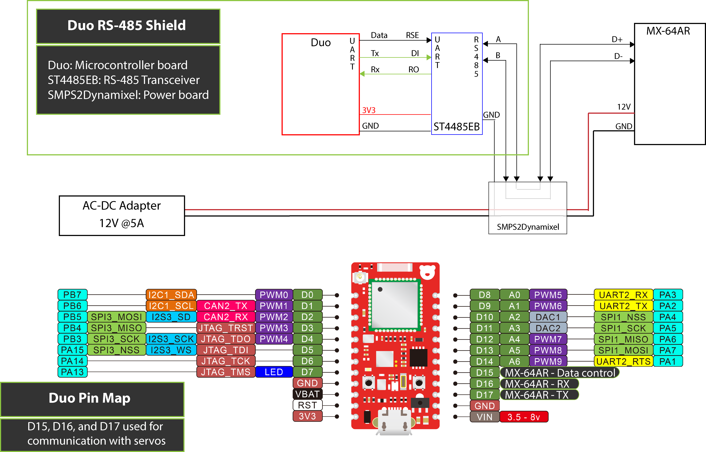

# DuoDMXL Hardware
## Shields for using a Duo (or Photon) with Dynamixel servomotors

There are two specific setups that may arise. The next two shields can be used, depending on the servomotor used. The library **DuoDMXL** works with either setup. The basic idea is that the DUO's TX and RX flow is controlled by the *data pin* and converted into the necessary signal.

The **Duo Tri-state Buffer Shield** is used for half-duplex communication to TTL signal.

The **Duo RS-485 Shield** is used to communicate with a RS-485 transceiver. It takes the TX and RX signals from the DUO (or Photon) and the signal of a control pin and outputs differential communication through the two signals D+ and D- (also called A and B).

In this folder there are EAGLE schematics (.sch) and board layouts (.brd) of both designs. Also, STEP and STL files are included for 3D modelling and design of cases, or if you need to include the shields into your design.
